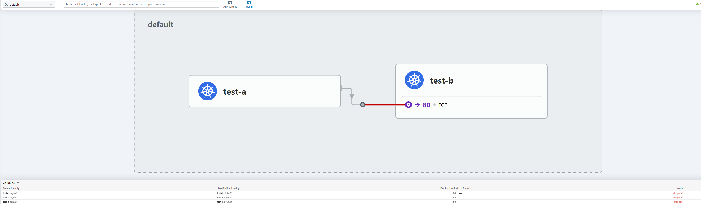

# Cilium learning - First sample

> **Learn Cilium CNI with hands-on examples, NetworkPolicies, and Financial Services use cases**

[](https://www.cncf.io/projects/cilium/)
[](https://cilium.io/)
[](https://creativecommons.org/licenses/by-sa/4.0/)

---

## 🎯 What You'll Learn

- **eBPF fundamentals** - Why it's revolutionary for networking
- **Cilium installation** - From zero to production-ready
- **NetworkPolicies** - L3/L4/L7 security policies
- **Hubble observability** - Network monitoring without agents
- **Kyverno integration** - Policy-as-Code governance
- **Financial Services** - PCI-DSS compliant architecture

---

## Quick Start

```bash
# 1. Clone repository
git clone https://github.com/christian-dussol-cloud-native/cilium.git
cd cilium-first-sample

# 2. Create Minikube cluster
chmod +x setup/*.sh
./setup/minikube-cluster.sh

# 3. Install Cilium CNI
./setup/install-cilium.sh

# 4. Verify installation
./setup/verify.sh

# 4. Install Hubble for observability
chmod +x observability/install-hubble.sh
./observability/install-hubble.sh

# Open a new terminal
cilium hubble port-forward

# Open a new terminal (one more)
cilium hubble ui
# You can access Hubble UI "http://localhost:12000" in your browser
# You can generate some traffic and observe in Hubble UI
# Generate some traffic
# kubectl exec test-pod-a -- curl http://test-service-b
# Monitor in Hubble UI by selecting your K8s namespace (default)
```



```bash
# 6. Deploy first NetworkPolicy
kubectl apply -f cilium-policies/l3-deny-all.yaml
```

You now have Cilium running with eBPF-powered networking.

---

## 📚 Repository Structure

```
cilium-first-sample/
├── setup/                 # Installation scripts
│   ├── minikube-cluster.sh    # Create Kubernetes cluster
│   ├── install-cilium.sh      # Install Cilium CNI
│   ├── verify.sh              # Verify installation
│   └── cleanup.sh             # Delete cluster
│
├── cilium-policies/       # Cilium NetworkPolicy examples
│   ├── l3-deny-all.yaml       # Layer 3: IP-based filtering
│   ├── l4-allow-specific.yaml # Layer 4: Port-based filtering
│   └── l7-http-methods.yaml   # Layer 7: HTTP method filtering
│
├── observability/         # Hubble monitoring
│   ├── install-hubble.sh      # Setup Hubble + UI
│   └── queries.md             # 50+ Hubble CLI examples
│
├── governance/            # Kyverno policies
│   ├── require-network-policy.yaml  # Enforce Zero Trust
│   └── enforce-labels.yaml          # Cost Management allocation
│
├── use-cases/             # Real-world examples
│   └── payment-api-demo.yaml        # PCI-DSS payment system
```

---

## 🎓 Learning Path

### Beginner
1. Understand eBPF basics and Cilium architecture
2. Deploy `cilium-policies/l3-deny-all.yaml` - Default deny policy
3. Test connectivity with demo pods
4. Observe traffic with `hubble observe --follow`

### Intermediate
1. Create treasury namespace: `kubectl create namespace treasury`
2. Deploy L4 policy: `cilium-policies/l4-allow-specific.yaml`
3. Deploy L7 policy: `cilium-policies/l7-http-methods.yaml`
4. Install Hubble UI: `./observability/install-hubble.sh`
5. Practice queries from `observability/queries.md`

### Advanced
1. Install Kyverno: `kubectl create -f https://github.com/kyverno/kyverno/releases/latest/download/install.yaml`
2. Apply governance: `governance/require-network-policy.yaml`
3. Deploy complete demo: `use-cases/payment-api-demo.yaml`
4. Customize policies for your use case

---

## Why Cilium?

### Performance vs Traditional CNI

| Metric | iptables | Cilium eBPF | Improvement |
|--------|----------|-------------|-------------|
| Rule evaluation | O(n) | O(1) | 100x faster |
| CPU overhead | 15% | 2% | 7.5x less |
| Memory | 2GB | 200MB | 10x less |
| Latency added | 500µs | 50µs | 10x faster |

### eBPF Advantages
- **Runs in kernel** - No context switches to user space
- **L7 visibility** - Understands HTTP, gRPC, Kafka, DNS
- **Zero overhead monitoring** - Built-in observability
- **Service mesh alternative** - No sidecars needed

---

## 🏦 Financial Services Use Case

The `payment-api-demo.yaml` demonstrates a **PCI-DSS compliant** payment processing system:

**Architecture:**
```
Internet → API Gateway → Payment Service → Database
```

**Security:**
- Default deny all traffic
- L7 HTTP method filtering (only POST/GET allowed)
- Database isolation (no internet access)
- Immutability enforcement (DELETE blocked)
- Full audit trail with Hubble

**Compliance:**
- PCI-DSS Requirement 1.2: Restrict connections
- PCI-DSS Requirement 1.3: DMZ for public services
- PCI-DSS Requirement 10.2: Automated audit logs

---

## 🔍 Hubble Observability

Hubble provides **zero-overhead network monitoring** without agents:

```bash
# Watch all traffic in real-time
hubble observe --follow

# Show blocked connections (security)
hubble observe --verdict DROPPED

# Monitor specific service
hubble observe --to-label app=payment-api

# HTTP traffic analysis
hubble observe --protocol http --http-status 500

# Financial Services: Detect unauthorized DB access
hubble observe --to-label tier=database --verdict DROPPED
```

See `04-observability/queries.md` for 50+ examples.

---

## Governance with Kyverno

Automate policy enforcement with Kyverno:

**Auto-generate default-deny policies:**
```bash
kubectl create namespace production
# → Kyverno automatically creates NetworkPolicy
```

**Enforce Cost Management labels:**
```bash
kubectl run test --image=nginx -n production
# → Rejected: "Pod must have team, cost-center labels"
```

**Benefits:**
- Zero Trust by default (no manual policies needed)
- Automated compliance (no external audits)
- Cost allocation enforcement (100% accuracy)

---

## 🛠️ Prerequisites

- **Minikube** 1.32+ - [Install guide](https://minikube.sigs.k8s.io/docs/start/)
- **kubectl** 1.28+ - [Install guide](https://kubernetes.io/docs/tasks/tools/)
- **4 CPU, 8GB RAM** - Recommended for testing
- **Docker** or **VirtualBox** - For Minikube driver

Optional (scripts auto-install):
- Cilium CLI
- Hubble CLI

---

## Testing Your Setup

After deploying the demo:

```bash
# 1. Check Cilium status
cilium status

# 2. Test connectivity
kubectl run test --rm -it --image=curlimages/curl -- \
  curl http://payment-service:8080/health

# 3. Verify policies block unauthorized access
kubectl run test --rm -it --image=curlimages/curl -- \
  curl -m 5 http://payment-db:5432
# Expected: timeout (blocked by policy)

# 4. View in Hubble UI
cilium hubble ui
# Open http://localhost:12000
```

---

## 📚 Resources

### Official Documentation
- [Cilium Docs](https://docs.cilium.io/)
- [eBPF.io](https://ebpf.io/)
- [Hubble Observability](https://docs.cilium.io/en/stable/observability/hubble/)
- [Kyverno Policies](https://kyverno.io/policies/)

### Community
- [Cilium Slack](https://cilium.io/slack)
- [CNCF Slack #cilium](https://cloud-native.slack.com/)
- [GitHub Discussions](https://github.com/cilium/cilium/discussions)

---

## 📝 License
This repository is licensed under Creative Commons Attribution-ShareAlike 4.0 International License.

[](https://creativecommons.org/licenses/by-sa/4.0/)

---

## 📌 Related Projects in "CNCF Project Focus" Series

- Episode #1: [Knative - Serverless on Kubernetes](https://github.com/christian-dussol-cloud-native/knative/tree/main)
- Episode #2: [Crossplane - Universal control plane for multi-cloud infrastructure.](https://github.com/christian-dussol-cloud-native/crossplane/tree/main)
- This is **#3 in the series: Cilium**: eBPF-powered CNI (you are here)

---

## ⭐ Star This Repository

If you find this helpful, please star the repository and share with your team!