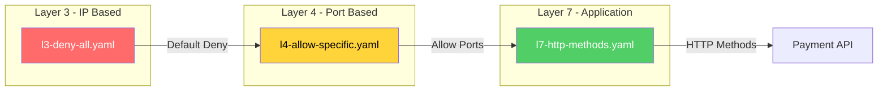
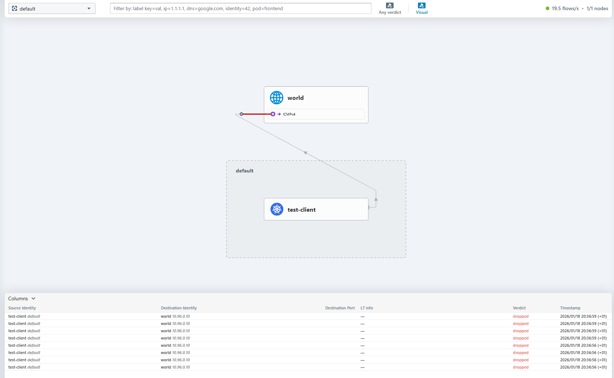
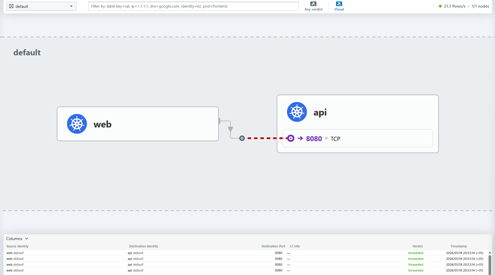
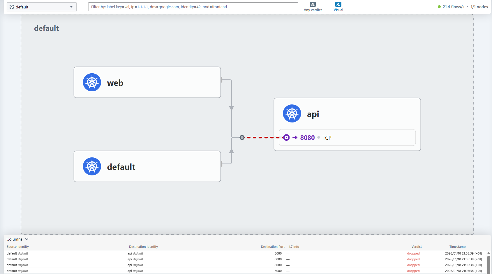

# Cilium Network Policies

This directory contains progressive examples of Cilium NetworkPolicies demonstrating L3, L4, and L7 filtering capabilities.

---

## Overview



| Policy | Layer | Description |
|--------|-------|-------------|
| `l3-deny-all.yaml` | L3 | Default deny all traffic (Zero Trust baseline) |
| `l4-allow-specific.yaml` | L4 | Allow specific ports between labeled pods |
| `l7-http-methods.yaml` | L7 | HTTP method and path filtering |

---

## 1. L3 - Default Deny All (`l3-deny-all.yaml`)

**Purpose**: Establish Zero Trust baseline by denying all traffic except essential services.

### What it allows
- DNS resolution (kube-dns on port 53/UDP)
- Kubernetes API server access
- Kubelet health checks

### What it blocks
- All pod-to-pod communication
- All external traffic

### Test Scenario

```bash
# 1. Apply the policy
kubectl apply -f l3-deny-all.yaml

# 2. Wait for pods to be ready
kubectl wait --for=condition=ready pod/test-client pod/test-server

# 3. Test connectivity (should FAIL)
kubectl exec test-client -- curl -m 5 test-server
```

**Expected**: Timeout after 5 seconds (policy blocks traffic)

```bash
# 4. Verify with Hubble
hubble observe --pod test-client
```

You should see `DROP` verdicts in the output.



---

## 2. L4 - Allow Specific Ports (`l4-allow-specific.yaml`)

**Purpose**: Allow frontend pods to access backend pods on specific ports only.

### Policy Rules

| Source | Destination | Ports | Protocol |
|--------|-------------|-------|----------|
| `tier: frontend` | `tier: backend` | 8080, 8443 | TCP |

### Included Resources
- `allow-frontend-to-backend` - Generic frontend/backend policy
- `treasury-db-access` - Financial services example (PostgreSQL)
- Demo pods: `frontend`, `backend`

### Test Scenario

```bash
# 1. Apply deny-all first (if not already)
kubectl apply -f l3-deny-all.yaml

# 2. Create treasury namespace (required for treasury-db-access policy)
kubectl create namespace treasury

# 3. Apply the L4 policy
kubectl apply -f l4-allow-specific.yaml

# 4. Test from frontend (should SUCCEED)
kubectl exec frontend -- curl -s http://backend:8080
```

**Expected**: `Backend API responding`



```bash
# 5. Test from unauthorized pod (should FAIL)
kubectl run test --rm -it --image=curlimages/curl -- curl -m 5 backend:8080
```

**Expected**: Timeout (no matching label)

```bash
# 6. Verify with Hubble
hubble observe --pod frontend
hubble observe --verdict DROPPED
```



---

## 3. L7 - HTTP Method Filtering (`l7-http-methods.yaml`)

**Purpose**: Control HTTP methods and paths at the application layer (no code changes required).

### Policy Rules

| Method | Path | Status |
|--------|------|--------|
| `POST` | `/api/v1/payment` | Allowed |
| `GET` | `/api/v1/payment/.*` | Allowed |
| `DELETE` | `/api/v1/payment/*` | **Blocked** |
| `PUT` | `/api/v1/payment/*` | **Blocked** |
| `PATCH` | `/api/v1/payment/*` | **Blocked** |
| `*` | `/admin/*` | **Blocked** |

### Test Scenario

```bash
# 1. Create trading namespace (required for gRPC policy)
kubectl create namespace trading

# 2. Apply all policies
kubectl apply -f l3-deny-all.yaml
kubectl apply -f l4-allow-specific.yaml
kubectl apply -f l7-http-methods.yaml

# 3. Wait for pods
kubectl wait --for=condition=ready pod -l app=payment-api
kubectl wait --for=condition=ready pod/frontend

# 4. Test allowed POST (should SUCCEED)
kubectl exec frontend -- curl -X POST http://payment-api:8080/api/v1/payment
```

**Expected**: 200 OK

```bash
# 5. Test allowed GET (should SUCCEED)
kubectl exec frontend -- curl -X GET http://payment-api:8080/api/v1/payment/123
```

**Expected**: 200 OK

```bash
# 6. Test blocked DELETE (should FAIL)
kubectl exec frontend -- curl -X DELETE http://payment-api:8080/api/v1/payment/123
```

**Expected**: 403 Forbidden or connection reset

```bash
# 7. Test blocked path (should FAIL)
kubectl exec frontend -- curl -X POST http://payment-api:8080/admin/reset
```

**Expected**: 403 Forbidden

```bash
# 8. Verify with Hubble
hubble observe --pod payment-api --protocol http
hubble observe --verdict DROPPED --http-status 403
```

---

## Advanced: gRPC Filtering

The `l7-http-methods.yaml` also includes an example for gRPC services:

```yaml
rules:
  http:
  - method: "POST"
    path: "/trading.TradeService/ExecuteTrade"
  - method: "POST"
    path: "/trading.TradeService/GetQuote"
  # Admin methods blocked by omission
```

Cilium understands gRPC natively - no Istio/Envoy sidecars required!

---

## Quick Reference

### Apply All Policies (Progressive)

```bash
# Zero Trust baseline
kubectl apply -f l3-deny-all.yaml

# Create namespaces (required for L4 and L7 policies)
kubectl create namespace treasury
kubectl create namespace trading

# Add port-based rules
kubectl apply -f l4-allow-specific.yaml

# Add HTTP method filtering
kubectl apply -f l7-http-methods.yaml
```

### View Active Policies

```bash
kubectl get ciliumnetworkpolicies
kubectl describe cnp <policy-name>
```

### Monitor with Hubble

```bash
# All traffic
hubble observe --follow

# Dropped traffic only
hubble observe --verdict DROPPED

# HTTP traffic
hubble observe --protocol http

# Specific pod
hubble observe --pod <pod-name>
```

### Cleanup

```bash
kubectl delete -f l3-deny-all.yaml
kubectl delete -f l4-allow-specific.yaml
kubectl delete -f l7-http-methods.yaml
```

---

## Benefits for Financial Services

| Requirement | How Cilium Addresses It |
|-------------|------------------------|
| **PCI-DSS 1.2.1** | Default deny all (Zero Trust) |
| **PCI-DSS 1.3** | Restrict outbound traffic |
| **Zero Trust** | Verify HTTP method + path per request |
| **Audit Trail** | Every L7 decision logged via Hubble |
| **No Code Changes** | Policies applied at network layer |

### Cost Management Impact

- Replaces WAF/API Gateway for internal traffic
- No Istio sidecars needed (less resource overhead)
- Kernel-level filtering = **50µs latency** vs 5ms for Envoy proxy

---

## Resources

- [Cilium L7 Policy Documentation](https://docs.cilium.io/en/stable/security/policy/language/#layer-7-examples)
- [HTTP Policy Examples](https://docs.cilium.io/en/stable/security/policy/language/#http)
- [gRPC Policy Examples](https://docs.cilium.io/en/stable/security/policy/language/#grpc)
