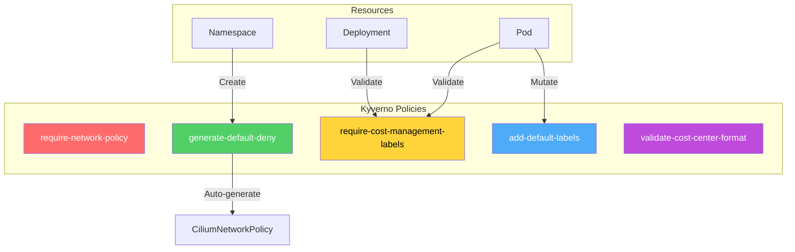
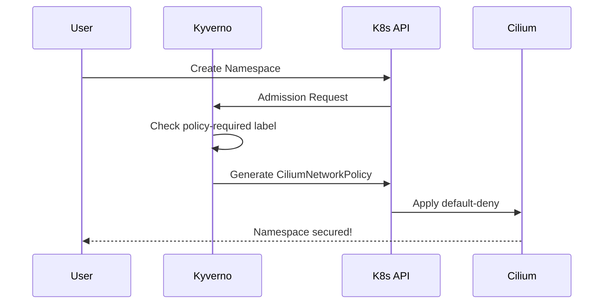

# Kyverno Governance Policies

This directory contains Kyverno policies for automated governance, enforcing Zero Trust networking and cost management compliance.

---

## Overview



| Policy | Type | Description |
|--------|------|-------------|
| `require-network-policy.yaml` | Validate + Generate | Enforce Zero Trust networking |
| `enforce-labels.yaml` | Validate + Mutate | Enforce cost management labels |

---

## Prerequisites

### Install Kyverno

```bash
# Install Kyverno
kubectl create -f https://github.com/kyverno/kyverno/releases/download/v1.12.0/install.yaml

# Wait for Kyverno to be ready
kubectl wait --for=condition=ready pod -n kyverno -l app.kubernetes.io/name=kyverno --timeout=120s

# Verify installation
kubectl get pods -n kyverno
```

---

## 1. Network Policy Governance (`require-network-policy.yaml`)

**Purpose**: Enforce Zero Trust by ensuring every namespace has a CiliumNetworkPolicy.

### Policies Included

| Policy | Action | Description |
|--------|--------|-------------|
| `require-network-policy` | Validate | Warn/block namespaces without policies |
| `generate-default-deny-policy` | Generate | Auto-create default-deny policy |

### How It Works



### Auto-Generated Policy

When a namespace is created, Kyverno automatically generates:

```yaml
apiVersion: cilium.io/v2
kind: CiliumNetworkPolicy
metadata:
  name: default-deny-all
spec:
  endpointSelector: {}
  egress:
  - toEndpoints:         # Allow DNS
    - matchLabels:
        k8s:io.kubernetes.pod.namespace: kube-system
        k8s:k8s-app: kube-dns
  - toEntities:          # Allow K8s API
    - kube-apiserver
  ingress:
  - fromEntities:        # Allow health checks
    - host
```

### Test Scenario

```bash
# 1. Apply the policy
kubectl apply -f require-network-policy.yaml

# 2. Create a test namespace
kubectl create namespace test-namespace

# 3. Verify auto-generated policy
kubectl get cnp -n test-namespace
```

**Expected**: `default-deny-all` policy created automatically

```bash
# 4. Test that traffic is blocked by default
kubectl run test -n test-namespace --image=nginx
kubectl run test-client -n test-namespace --image=curlimages/curl -- sleep 3600
kubectl exec -n test-namespace test-client -- curl -m 5 test
```

**Expected**: Connection timeout (policy blocks by default)

```bash
# 5. View Kyverno policy reports
kubectl get policyreport -n test-namespace
```

### Switch to Enforce Mode

```bash
# Edit line 16: validationFailureAction: Enforce
kubectl apply -f require-network-policy.yaml

# Now Kyverno will BLOCK namespace creation without policies!
```

---

## 2. Cost Management Labels (`enforce-labels.yaml`)

**Purpose**: Enforce cost allocation labels for accurate chargeback and reporting.

### Policies Included

| Policy | Action | Description |
|--------|--------|-------------|
| `require-cost-management-labels` | Validate | Require labels on Pods/Deployments |
| `add-default-cost-management-labels` | Mutate | Auto-add default labels |
| `validate-cost-center-format` | Validate | Enforce CC-XXXX format |

### Required Labels

| Label | Required Values | Example |
|-------|-----------------|---------|
| `team` | Any string | `treasury`, `payments` |
| `environment` | `dev`, `qa`, `staging`, `production` | `production` |
| `cost-center` | Format: `CC-XXXX` | `CC-7890` |
| `app` | Any string | `payment-processor` |

### Compliant Example

```yaml
apiVersion: apps/v1
kind: Deployment
metadata:
  name: payment-processor
  namespace: treasury
  labels:
    team: treasury
    environment: production
    cost-center: CC-7890
    app: payment-processor
spec:
  template:
    metadata:
      labels:
        team: treasury
        environment: production
        cost-center: CC-7890
        app: payment-processor
```

### Test Scenario

```bash
# 1. Apply the policies
kubectl apply -f enforce-labels.yaml

# 2. The treasury namespace is created with cost-management-required: "true"

# 3. Test compliant deployment (should SUCCEED)
kubectl apply -f - <<EOF
apiVersion: apps/v1
kind: Deployment
metadata:
  name: compliant-app
  namespace: treasury
  labels:
    team: treasury
    environment: production
    cost-center: CC-7890
    app: test
spec:
  selector:
    matchLabels:
      app: test
  template:
    metadata:
      labels:
        team: treasury
        environment: production
        cost-center: CC-7890
        app: test
    spec:
      containers:
      - name: nginx
        image: nginx:alpine
EOF
```

**Expected**: Deployment created successfully

```bash
# 4. Test non-compliant deployment (should show warning in Audit mode)
kubectl run test --image=nginx -n treasury

# 5. View policy violations
kubectl get policyreport -n treasury
kubectl describe policyreport -n treasury
```

### Switch to Enforce Mode

```bash
# Edit line 15: validationFailureAction: Enforce
kubectl apply -f enforce-labels.yaml

# Now try non-compliant (should be REJECTED)
kubectl run test2 --image=nginx -n treasury
```

**Expected**: `Pod must have Cost Management labels: team, environment, cost-center, and app.`

### Query Costs by Team

```bash
kubectl get pods -A -l team=treasury -o json | \
  jq -r '.items[] | "\(.metadata.name): \(.spec.containers[].resources.requests.cpu)"'
```

### Prometheus Query for Cost Tracking

```promql
sum by (team, environment) (
  kube_pod_container_resource_requests{resource="cpu"}
)
```

---

## Quick Reference

### Apply All Policies

```bash
# Network policy governance
kubectl apply -f require-network-policy.yaml

# Cost management labels
kubectl apply -f enforce-labels.yaml
```

### View Policy Status

```bash
# List all Kyverno policies
kubectl get clusterpolicy

# View policy details
kubectl describe clusterpolicy require-network-policy

# View policy reports
kubectl get policyreport -A
kubectl describe policyreport -n <namespace>
```

### Cleanup

```bash
kubectl delete -f require-network-policy.yaml
kubectl delete -f enforce-labels.yaml
kubectl delete namespace test-namespace treasury
```

---

## Compliance Benefits

### Financial Services

| Requirement | How Kyverno Addresses It |
|-------------|-------------------------|
| **PCI-DSS 1.2** | Restrict connections between trusted/untrusted |
| **SOC 2** | Automated control implementation |
| **GDPR** | Data isolation enforcement |
| **SOX** | Accurate cost attribution for financial statements |
| **IFRS 16** | Proper cost allocation for lease accounting |

### Cost Management Impact

| Benefit | Impact |
|---------|--------|
| Automated cost allocation | No manual spreadsheet tracking |
| Accurate chargeback | Per team/cost-center |
| Budget alerts | Cloud provider integration |
| Showback reports | Generated automatically |

### Financial Impact

- Enable granular budgets per team
- Identify cost optimization opportunities per cost-center
- Eliminate manual policy creation

---

## Resources

- [Kyverno Documentation](https://kyverno.io/docs/)
- [Kyverno Policy Library](https://kyverno.io/policies/)
- [Cilium + Kyverno Integration](https://docs.cilium.io/en/stable/security/policy/)
