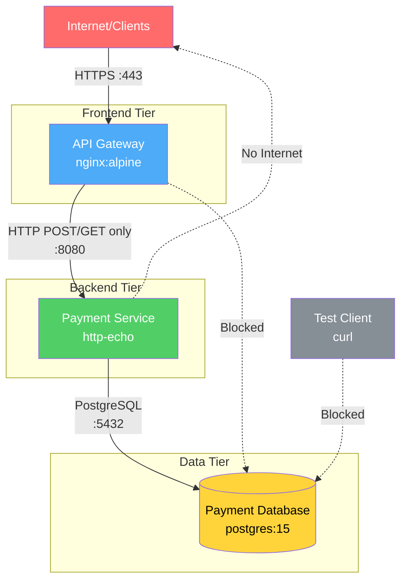
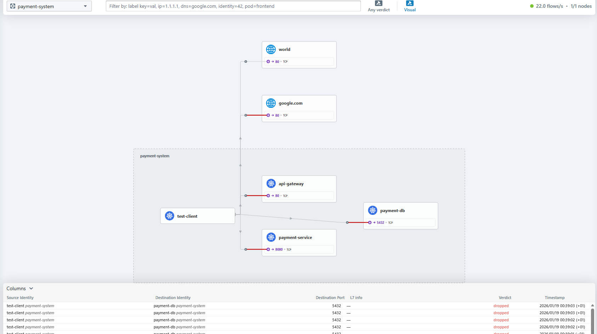
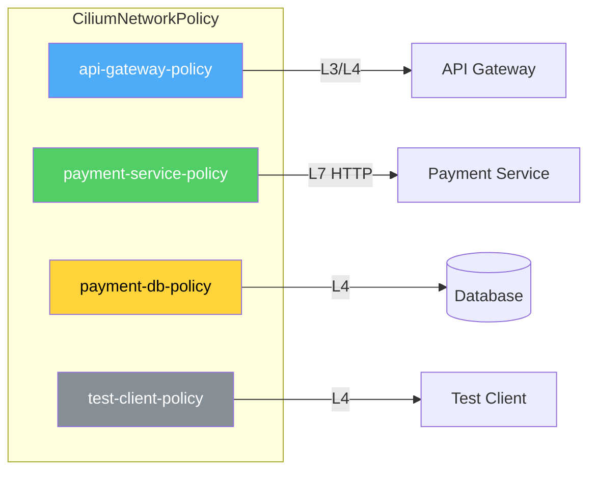

# Payment API Demo - Financial Services Zero Trust Architecture

This demo showcases Cilium's capabilities for securing a payment processing system in a financial services environment with **PCI-DSS requirements**.

---

## Architecture Overview



### Traffic Flow

| Source | Destination | Port | Protocol | Status |
|--------|-------------|------|----------|--------|
| Internet | API Gateway | 80/443 | HTTP/HTTPS | Allowed |
| API Gateway | Payment Service | 8080 | HTTP (POST/GET only) | Allowed |
| Payment Service | Payment DB | 5432 | PostgreSQL | Allowed |
| API Gateway | Payment DB | 5432 | - | **Blocked** |
| Payment Service | Internet | - | - | **Blocked** |
| Test Client | Payment DB | 5432 | - | **Blocked** |

---

## Components

### 1. Database Tier (`payment-db`)

- **Image**: `postgres:15-alpine`
- **Replicas**: 2
- **Port**: 5432
- **Policy**: Accept connections **only** from `payment-service`

### 2. Backend Tier (`payment-service`)

- **Image**: `hashicorp/http-echo:latest`
- **Replicas**: 3
- **Port**: 8080
- **L7 Policy**:
  - `POST /api/v1/payment` - Create payment
  - `GET /api/v1/payment/.*` - Get payment status
  - `GET /health` - Health check
  - `DELETE`, `PUT`, `PATCH` - **Blocked** (immutability for audit)

### 3. Frontend Tier (`api-gateway`)

- **Image**: `nginx:alpine`
- **Replicas**: 2
- **Port**: 80 (LoadBalancer)
- **Policy**: Accept from internet, egress only to `payment-service`

### 4. Test Client (`test-client`)

- **Image**: `curlimages/curl:latest`
- Used for testing network policies
- **Policy**: `test-client-policy` - egress only to `api-gateway:80` and DNS
- **Note**: This pod simulates an external client - it can only access the `api-gateway`, not internal services directly or the internet

---

## Quick Start

```bash
# 1. Deploy everything
kubectl apply -f payment-api-demo.yaml

# 2. Wait for all pods to be ready
kubectl wait --for=condition=ready pod --all -n payment-system --timeout=120s

# 3. Check deployment status
kubectl get pods -n payment-system
```

---

## Test Scenarios

### Scenario A: Test Client to API Gateway (ALLOWED)

The test-client simulates an external client accessing the API Gateway.

```bash
kubectl exec -n payment-system test-client -- \
  curl -s http://api-gateway
# Expected: nginx welcome page (gateway is accessible)
```

### Scenario B: Test Client Direct to Payment Service (BLOCKED - L3/L4)

The test-client cannot bypass the gateway to access internal services directly.

```bash
kubectl exec -n payment-system test-client -- \
  curl -m 5 http://payment-service:8080/api/v1/payment
# Expected: timeout (test-client is not authorized, only api-gateway can reach payment-service)
```

### Scenario C: Test Client Direct to Database (BLOCKED - L3/L4)

The test-client cannot access the database directly.

```bash
kubectl exec -n payment-system test-client -- \
  curl -m 5 http://payment-db:5432
# Expected: timeout (only payment-service can reach the database)
```

### Scenario D: Internet Access from Test Client (BLOCKED - Egress)

The test-client cannot access the internet (no egress to world allowed).

```bash
kubectl exec -n payment-system test-client -- \
  curl -m 5 http://google.com
# Expected: timeout (no egress to world)
```

> **Note**: The `payment-service` uses `hashicorp/http-echo` which doesn't have curl/wget. The egress restriction applies to all pods in the namespace via the network policies.



---

## Understanding the L7 Policy

The L7 HTTP filtering is applied between `api-gateway` and `payment-service`. Since `api-gateway` uses nginx (which doesn't have curl), we cannot directly test the L7 filtering from the command line in this demo.

**What the L7 policy enforces:**
- `POST /api/v1/payment` - Allowed (create payment)
- `GET /api/v1/payment/.*` - Allowed (get payment status)
- `GET /health` - Allowed (health check)
- `DELETE`, `PUT`, `PATCH` - **Blocked** (immutability for audit)
- Any other path - **Blocked**

**To verify L7 filtering with Hubble:**

```bash
# Watch HTTP traffic to payment-service
hubble observe -n payment-system --pod payment-service --protocol http --follow
```

In a production scenario, the nginx gateway would be configured to proxy requests to the payment-service, and Cilium would enforce the L7 rules on that traffic.

---

## Observability with Hubble

```bash
# Watch all traffic in payment-system namespace
hubble observe --namespace payment-system --follow

# View only dropped/blocked traffic
hubble observe -n payment-system --verdict DROPPED

# Filter HTTP traffic only
hubble observe -n payment-system --protocol http

# Check policy status
kubectl get cnp -n payment-system
kubectl describe cnp payment-service-policy -n payment-system
```

---

## PCI-DSS Compliance Mapping

| Requirement | Description | Implementation |
|-------------|-------------|----------------|
| **1.2.1** | Restrict inbound/outbound traffic | CiliumNetworkPolicy (default deny) |
| **1.3.1** | DMZ for internet-facing systems | API Gateway in separate tier with restricted egress |
| **1.3.4** | Do not allow unauthorized outbound | Payment service cannot reach internet |
| **2.2.1** | One primary function per server | Each microservice has single responsibility |
| **6.6** | Ensure all traffic validated | L7 HTTP method filtering on payment service |
| **10.2.2** | Automated audit trails | Hubble logs all allowed/denied connections |
| **11.4** | Use network segmentation | Logical segmentation via NetworkPolicies |

---

## Network Policies Summary



| Policy | Layer | Rules |
|--------|-------|-------|
| `api-gateway-policy` | L3/L4 | Accept from `world`, egress to `payment-service:8080` |
| `payment-service-policy` | L7 | HTTP method filtering, egress to `payment-db:5432` |
| `payment-db-policy` | L4 | Accept only from `payment-service:5432` |
| `test-client-policy` | L4 | Egress only to `api-gateway:80` (no internet) |

---

## Cost Management Labels

All resources include cost allocation labels for financial tracking:

```yaml
labels:
  team: payments
  cost-center: CC-5000
  environment: production
  pci-scope: "in-scope"
```

---

## Resources

- [Cilium L7 Policies Documentation](https://docs.cilium.io/en/stable/security/policy/language/#layer-7-examples)
- [Hubble Observability](https://docs.cilium.io/en/stable/observability/hubble/)
- [Kyverno Integration](https://kyverno.io/policies/)
- [PCI-DSS Guidelines](https://www.pcisecuritystandards.org/pci_security/)

---

## Cleanup

```bash
kubectl delete namespace payment-system
```
